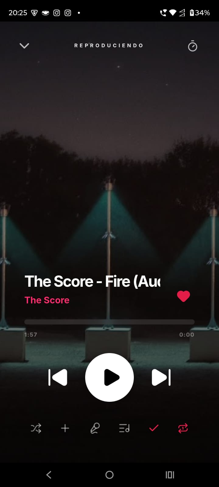

# 🎶 ChrisMusic 

**ChrisMusic** is a high-performance, premium music streaming web application built with the latest technologies. Designed for a seamless, distraction-free listening experience, it focuses on performance, aesthetics, and privacy.

<div align="center">
  
</div>

## ✨ Key Features

- 🎧 **Premium Player**: Full-screen player with lyrics, volume control, and progress tracking.
- 🌓 **Dynamic Themes**: Beautiful, high-contrast Light and Dark modes with smooth transitions.
- 📜 **Synced Lyrics**: Integrated lyrics fetching and real-time synchronization.
- 📊 **Library Management**: Create playlists, mark favorites, and track your listening history.
- 📱 **PWA Support**: Installable on mobile and desktop devices with offline detection.
- 🔒 **Local-First Privacy**: Your history and playlists are stored locally on your device (IndexedDB).
- 🚀 **Next-Gen Tech**: Built with Next.js 16, React 19, and Tailwind CSS 4.
- 📱 **Multi-Platform Native**: Android (via Capacitor + ExoPlayer) and Windows (via Tauri + Rust yt-dlp).
- 🔄 **Over-The-Air (OTA) Updates**: Seamless, serverless app updates directly from GitHub Releases for Desktop & Mobile.
## 🛠️ Tech Stack

- **Framework**: [Next.js 16 (App Router)](https://nextjs.org/)
- **UI**: [React 19](https://react.dev/), [Tailwind CSS 4](https://tailwindcss.com/), [Framer Motion](https://www.framer.com/motion/)
- **State Management**: [Zustand](https://zustand-demo.pmnd.rs/)
- **Database**: [Dexie.js (IndexedDB)](https://dexie.org/)
- **Icons**: [Lucide React](https://lucide.dev/)
- **Components**: [Shadcn UI](https://ui.shadcn.com/) (adapted for Tailwind 4)
- **PWA**: [@ducanh2912/next-pwa](https://github.com/ducanh2912/next-pwa)

## 🚀 Getting Started

1.  **Clone the repository**:
    ```bash
    git clone https://github.com/C-Ford17/ChrisMusic.git
    cd ChrisMusic
    ```

2.  **Install dependencies**:
    ```bash
    npm install
    ```

3.  **Run in development**:
    ```bash
    npm run dev
    ```

4.  **Build for production**:
    ```bash
    npm run build
    npm start
    ```

## 🏁 Current Status (v1.0.0)

- [x] **Premium UI Refactor**: Immersive full-screen player, lyrics panel, and advanced library view.
- [x] **Light/Dark & Accent Colors**: Dynamic, gorgeous theme adjustments and CSS variable accents.
- [x] **Native Android ExoPlayer Backbone**: Flawless background audio rendering via Capacitor.
- [x] **Tauri Windows Extractor**: Ultra-fast YouTube extraction with Rust-powered `yt-dlp` integration.
- [x] **Serverless Auto-Updater**: Zero-cost independent OTA updates system using GitHub `.json` manifests & Releases.
- [ ] **Unit Testing & Optimization**: Target Lighthouse PWA Audit score > 90.

## 🤝 Contribution

Contributions are welcome! Feel free to open issues or pull requests.

## 📄 License

This project is licensed under the **PolyForm Noncommercial License 1.0.0**. 

**Note:** This is a **Source Available** license. You may use, modify, and distribute this software for personal and non-commercial purposes only. Commercial use is strictly prohibited. See the [LICENSE](LICENSE) and [NOTICE](NOTICE) files for full details.

© 2026 Christian. Built with ❤️ for the music community.

